# Terraform Infrastructure Automation — AWS

---
[](https://developer.hashicorp.com/terraform)
[](https://aws.amazon.com/)
[](https://github.com/olajide-adedayo/terraform-infrastructure-automation-aws)

---

## Infrastructure as Code implementation for provisioning and managing AWS compute infrastructure with Terraform.

This project demonstrates a production-oriented Terraform workflow for defining, provisioning, validating, and managing AWS infrastructure through declarative configuration. The implementation includes Amazon EC2 provisioning, dynamic AMI discovery, SSH security-group configuration, Terraform state management, infrastructure planning, deployment, lifecycle operations, and post-deployment verification.

Core Technologies: Terraform · AWS · Amazon EC2 · AWS CLI · Infrastructure as Code»

---

## 1. Project Overview

### Purpose

This project implements an Infrastructure as Code (IaC) workflow for provisioning and managing AWS compute infrastructure using Terraform. The objective is to replace manual infrastructure configuration with a repeatable, declarative, and version-controlled approach to AWS resource management.

### Project Summary

The implementation provisions an Amazon EC2 instance using Terraform and integrates supporting AWS infrastructure components required for secure and controlled access.

The Terraform configuration defines the infrastructure, dynamically discovers a suitable Ubuntu AMI, creates an EC2 key pair, configures a security group, provisions the compute instance, and manages the resulting infrastructure through Terraform state.

The deployed infrastructure was validated through Terraform commands, AWS CLI queries, and the AWS Management Console to confirm that the declared configuration corresponded with the actual AWS environment.

### Engineering Scope

The project covers:

- Terraform-based Infrastructure as Code
- AWS provider configuration
- Amazon EC2 provisioning
- Dynamic Ubuntu AMI discovery using a Terraform data source
- EC2 key-pair management
- Security-group configuration
- Restricted SSH access using a specific IPv4 source
- HTTP access configuration
- Terraform state management
- Infrastructure validation and execution planning
- Infrastructure deployment and lifecycle operations
- AWS CLI-based infrastructure verification
- AWS Management Console verification
- Cost-conscious EC2 lifecycle management
- Secure handling of private keys and Terraform state files

### Implementation Outcome

The completed implementation successfully provisioned and managed the defined AWS infrastructure through Terraform, with the resulting resources verified against Terraform state and the AWS environment.

The EC2 instance was subsequently stopped after verification as part of the project's cost-control and resource-lifecycle management practices.

---

## 2. Engineering Objective

### Problem

Managing cloud infrastructure manually can introduce configuration inconsistencies, reduce repeatability, and make infrastructure changes difficult to track and reproduce. A declarative Infrastructure as Code approach provides a controlled way to define infrastructure requirements, review proposed changes, and maintain alignment between configuration and deployed resources.

### Objective

The objective of this project was to implement a Terraform-driven AWS infrastructure workflow that provides a repeatable and auditable approach to provisioning and managing compute infrastructure.

The implementation was designed to demonstrate practical engineering capabilities across:

- Declarative infrastructure definition
- AWS resource provisioning through Terraform
- Dynamic AMI discovery
- Secure network-access configuration
- Terraform state management
- Infrastructure validation and change planning
- Controlled infrastructure deployment
- Post-deployment verification
- EC2 lifecycle and cost management

### Expected Outcome

The expected outcome was a functioning AWS infrastructure environment provisioned from Terraform configuration and verifiable through both Terraform and AWS tooling.

The implementation achieved this outcome by provisioning the defined EC2 infrastructure, maintaining its state through Terraform, validating the resulting AWS resources, and performing lifecycle operations after successful verification.

---

## 3. Solution Architecture

The solution uses Terraform as the Infrastructure as Code control layer between the local engineering environment and AWS. Terraform evaluates the declared configuration, retrieves required information through AWS data sources, provisions the defined resources through the AWS provider, and records the resulting infrastructure in Terraform state.

### Architecture Workflow

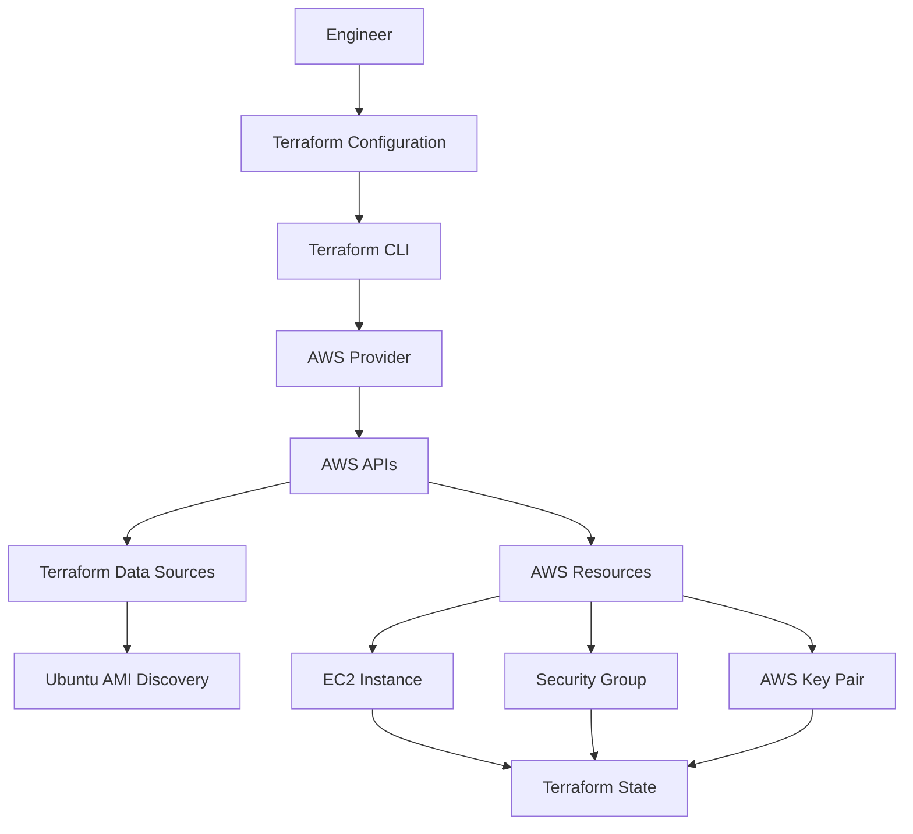
### Architecture Components

Component| Role
Terraform| Declaratively defines and manages the AWS infrastructure
Terraform AWS Provider| Enables Terraform to communicate with AWS APIs
AWS EC2| Provides the compute infrastructure provisioned by Terraform
Terraform Data Source| Dynamically retrieves the appropriate Ubuntu AMI information
AWS Security Group| Controls inbound network access to the EC2 instance
AWS Key Pair| Provides SSH authentication capability for the EC2 instance
Terraform State| Records the relationship between Terraform configuration and managed AWS resources
AWS CLI| Provides command-line verification of deployed AWS infrastructure

### Infrastructure Flow

The implementation follows a declarative workflow:

Terraform Configuration
        |
        v
terraform init
        |
        v
terraform validate
        |
        v
terraform plan
        |
        v
terraform apply
        |
        v
AWS Infrastructure
        |
        v
Terraform State
        |
        v
AWS CLI / AWS Console Verification

### Design Characteristics

The architecture is intentionally simple and modular at the resource-configuration level, while demonstrating core Terraform engineering practices:

- Declarative infrastructure management
- Dynamic infrastructure information retrieval
- Separation of infrastructure resources and data sources
- Controlled network access
- State-based infrastructure reconciliation
- Plan-before-apply workflow
- Independent verification of deployed resources

---

## 4. Technology Stack

Technology| Role in the Project
Terraform| Infrastructure as Code for defining, provisioning, and managing AWS infrastructure
Amazon Web Services (AWS)| Cloud platform hosting the provisioned infrastructure
Amazon EC2| Compute infrastructure provisioned and managed through Terraform
AWS Security Groups| Network access control for the EC2 instance
AWS Key Pair| SSH authentication mechanism associated with the EC2 instance
Terraform AWS Provider| Integration layer between Terraform and AWS APIs
Terraform Data Sources| Dynamic discovery of AWS infrastructure information, including the Ubuntu AMI
Terraform State| Tracks managed infrastructure and enables configuration-to-resource reconciliation
AWS CLI| Command-line inspection and verification of AWS resources
PowerShell| Local command-line environment used to execute Terraform and AWS CLI workflows
Visual Studio Code| Development environment used to create and manage Terraform configuration

Infrastructure Technologies

- Cloud Platform: AWS
- Compute: Amazon EC2
- Infrastructure as Code: Terraform
- Operating System Image: Ubuntu Server
- Network Security: AWS Security Groups
- Authentication: AWS Key Pair / SSH
- Infrastructure Verification: Terraform CLI, AWS CLI, AWS Management Console

Terraform Capabilities Demonstrated

- Provider configuration
- Resource definitions
- Data sources
- Resource attributes and dependencies
- Outputs
- Terraform state management
- Configuration validation
- Execution planning
- Infrastructure provisioning
- Infrastructure reconciliation
- Resource lifecycle management

---

## 5. Repository Structure

The repository uses a modular Terraform configuration structure in which infrastructure components are separated into focused Terraform files. This improves readability, maintainability, and clarity when managing individual infrastructure components.

```text
terraform-infrastructure-automation-aws/
│
├── screenshots/
│   ├── 01-terraform-project-structure.png
│   ├── 02-terraform-init-success.png
│   ├── 03-terraform-validate-success.png
│   ├── 04-terraform-plan-no-changes.png
│   ├── 05-terraform-state-resources.png
│   ├── 06-terraform-security-group-configuration.png
│   ├── 07-terraform-ec2-resource.png
│   ├── 08-aws-ec2-verification.png
│   ├── 09-aws-console-ec2-instance.png
│   └── 10-aws-security-group-rules.png
│
├── .gitignore
├── .terraform.lock.hcl
├── instance-id.tf
├── instance.tf
├── keypair.tf
├── provider.tf
├── secgrp.tf
└── README.md
```

### File Responsibilities

| File / Directory | Responsibility |
|---|---|
| `provider.tf` | Configures the Terraform AWS provider and target AWS region |
| `instance.tf` | Defines the Amazon EC2 instance and its configuration |
| `instance-id.tf` | Defines the Terraform output for the EC2 instance ID |
| `keypair.tf` | Defines the AWS EC2 key-pair configuration |
| `secgrp.tf` | Defines the AWS security group and its network access rules |
| `.terraform.lock.hcl` | Records the selected Terraform provider version and dependency checksums |
| `.gitignore` | Specifies files and directories that should not be tracked by Git |
| `screenshots/` | Contains selected screenshots documenting the implementation and verification evidence |
| `README.md` | Provides the technical documentation for the project |

---

## 6. Terraform Configuration

The infrastructure is defined using Terraform's declarative configuration language (HCL). The configuration is separated into focused Terraform files, with each file responsible for a specific infrastructure or configuration concern.

### Provider Configuration

The AWS provider establishes the connection between Terraform and the AWS environment and specifies the AWS region in which the infrastructure is managed.

The project uses the AWS provider with the deployment region configured as:

```hcl
provider "aws" {
  region = "us-east-1"
}
```

This configuration directs Terraform to manage the project's AWS resources in the **US East (N. Virginia) — `us-east-1`** region.

### Resource Configuration

The project defines AWS infrastructure using Terraform resources.

The primary compute resource is an Amazon EC2 instance. Supporting resources include the EC2 key pair and security group required for instance access and network control.

The main resource configuration is organized as follows:

| Configuration | Purpose |
|---|---|
| `instance.tf` | Defines the Amazon EC2 instance |
| `keypair.tf` | Defines the EC2 key-pair configuration |
| `secgrp.tf` | Defines the security group and network access rules |

Terraform evaluates these resource definitions and determines the required actions during `terraform plan` before changes are applied to AWS.

### Data Sources

The project uses a Terraform data source to dynamically discover an appropriate Ubuntu AMI rather than hard-coding an AMI ID without verification.

The AMI lookup uses defined selection criteria, including the AMI owner and image characteristics, allowing Terraform to retrieve a suitable image available in the configured AWS region.

This approach is useful because **AMI IDs are region-specific** and can change as new image versions are published.

### Outputs

The project exposes the EC2 instance ID through a Terraform output.

The output is defined in:

```text
instance-id.tf
```

The output provides a convenient way to retrieve the identifier of the Terraform-managed EC2 instance after deployment.

### Configuration Organization

The Terraform configuration follows a simple separation of concerns:

```text
provider.tf
    │
    ├── AWS Provider
    │
    ├── instance.tf
    │      └── EC2 Instance
    │
    ├── keypair.tf
    │      └── EC2 Key Pair
    │
    ├── secgrp.tf
    │      └── Security Group
    │
    └── instance-id.tf
           └── EC2 Instance ID Output
```

This structure keeps the configuration readable while allowing Terraform to treat the `.tf` files in the working directory as a single configuration.

---

## 7. AMI Discovery and Selection

Amazon Machine Images (AMIs) provide the operating system and software baseline used when launching EC2 instances. Because AMI identifiers are specific to AWS regions and image versions, selecting an appropriate AMI is an important part of reliable EC2 provisioning.

### Why AMI Discovery Matters

Hard-coding an AMI ID without understanding its region, publisher, architecture, or image version can make infrastructure configurations less portable and more difficult to maintain.

Terraform data sources provide a way to query existing AWS information and use the resulting data within infrastructure configuration.

In this project, Terraform was used to discover an appropriate Ubuntu AMI for the EC2 instance rather than relying solely on an unexplained hard-coded image identifier.

### AMI Selection Criteria

The AMI discovery configuration used criteria based on the required Ubuntu image characteristics, including:

- Ubuntu operating system
- AWS region
- AMI owner
- Image naming pattern
- Compatible virtualization characteristics
- Most recent matching image

The AMI owner value used for the Ubuntu image lookup was:

```text
099720109477
```

This identifies the Ubuntu publisher used by the AMI discovery configuration.

### Discovery Method

The AMI was discovered through a Terraform AWS data source. Terraform queried AWS for images matching the configured criteria and selected the most recent matching image.

The resulting AMI information was then used by the EC2 resource configuration.

This approach separates **AMI discovery** from **EC2 resource provisioning**, allowing the infrastructure configuration to obtain the required image information dynamically.

### AMI Verification

The deployed EC2 instance was verified through AWS tooling, confirming the AMI used by the running infrastructure.

Verified instance information included:

| Attribute | Verified Value |
|---|---|
| Instance ID | `i-0a14db2822c4f7927` |
| AMI ID | `ami-06e78a71af43ef21a` |
| AMI Platform | Linux/UNIX |
| AMI Operating System | Ubuntu Server 22.04 LTS |
| AWS Region | `us-east-1` |
| Availability Zone | `us-east-1a` |

The AWS Console identified the image as:

```text
ubuntu/images/hvm-ssd/ubuntu-jammy-22.04-amd64-server-20260731
```

### Engineering Consideration

Using an AMI data source improves the maintainability of the configuration by allowing Terraform to discover an appropriate image based on defined criteria.

However, dynamically selecting the most recent image also means that future executions may resolve to a newer image when the matching criteria change. In production environments, AMI selection should therefore be balanced between **automation, reproducibility, security updates, and controlled image versioning**.

---

## 8. Terraform Workflow

The infrastructure was managed through a controlled Terraform workflow that progressed from configuration preparation and validation to planning, deployment, and post-deployment verification.

The workflow was:

```text
Terraform Configuration
        |
        v
terraform fmt
        |
        v
terraform init
        |
        v
terraform validate
        |
        v
terraform plan
        |
        v
terraform apply
        |
        v
AWS Infrastructure
        |
        v
Terraform State
        |
        v
AWS CLI / AWS Console Verification
```

### `terraform fmt`

`terraform fmt` was used to format the Terraform configuration according to Terraform's standard formatting conventions.

This provides consistent code formatting and improves readability before validation and execution.

### `terraform init`

`terraform init` initialized the Terraform working directory and prepared the required provider dependencies.

The command also generated and maintained the Terraform dependency lock file:

```text
.terraform.lock.hcl
```

The successful initialization was captured as part of the project implementation evidence.

### `terraform validate`

`terraform validate` was used to verify that the Terraform configuration was syntactically valid and internally consistent.

Successful validation confirmed that the configuration could be processed by Terraform before proceeding with infrastructure planning.

### `terraform plan`

`terraform plan` was used to evaluate the difference between the Terraform configuration, Terraform state, and the infrastructure Terraform manages.

The plan provided a controlled preview of infrastructure changes before they were applied.

The implementation also demonstrated a **no-change plan**, confirming that Terraform recognized the infrastructure as matching the current configuration at that point in the workflow.

### `terraform apply`

`terraform apply` was used to execute the approved Terraform configuration against AWS.

This resulted in the provisioning and management of the configured AWS infrastructure, including the EC2 instance and its supporting configuration.

Terraform recorded the resulting infrastructure information in its state.

### Verification

The deployed infrastructure was independently verified using both the AWS CLI and AWS Management Console.

The AWS CLI was used to inspect the EC2 instance and confirm attributes including:

- Instance ID
- Instance state
- Instance type
- AMI ID
- Key pair
- Availability Zone
- Private IP address
- Public IP address

The AWS Management Console was also used to verify the EC2 instance and associated security group configuration.

This combination of Terraform and AWS-native verification provided independent evidence that the infrastructure matched the intended configuration.

---

## 9. Infrastructure Lifecycle Management

Terraform was used throughout the infrastructure lifecycle to provision, inspect, evaluate, and reconcile the AWS resources defined by the configuration.

The lifecycle approach followed the principle of making infrastructure changes through declarative configuration and reviewing Terraform's proposed actions before applying them.

### Create

The infrastructure was provisioned through Terraform using the configured AWS resources.

The primary infrastructure created during the implementation was an Amazon EC2 instance supported by:

- An AWS EC2 key pair
- An AWS security group
- A dynamically selected Ubuntu AMI

Terraform recorded the resulting infrastructure in its state after successful provisioning.

### Inspect

The deployed EC2 infrastructure was inspected using both Terraform and AWS-native tools.

AWS CLI verification confirmed key infrastructure attributes, including:

```text
Instance ID:          i-0a14db2822c4f7927
Instance State:       stopped
Instance Type:        t3.micro
AMI ID:               ami-06e78a71af43ef21a
Availability Zone:    us-east-1a
Private IP:           172.31.14.57
```

The AWS Management Console was also used to inspect the EC2 instance and its associated security group configuration.

### Update

The Terraform configuration was evaluated through the normal plan-and-apply workflow when infrastructure configuration changes were introduced.

Terraform uses the configuration and recorded state to determine whether an update is required and what actions would be necessary to bring the managed infrastructure into the desired configuration.

### Plan-Based Change Detection

`terraform plan` was used to identify differences between the declared Terraform configuration, recorded state, and managed AWS infrastructure.

This provides a controlled mechanism for reviewing infrastructure changes before execution.

A subsequent plan produced:

```text
No changes. Your infrastructure matches the configuration.
```

This confirmed that Terraform considered the managed infrastructure reconciled with the current configuration.

### State Reconciliation

Terraform state provided the reference information required to associate the declared Terraform resources with their corresponding AWS resources.

During reconciliation, Terraform evaluated the configuration and state to determine whether additional infrastructure changes were required.

The successful no-change plan demonstrated that the configuration and Terraform-managed infrastructure were aligned at the time of verification.

### Resource Lifecycle and Cost Management

The EC2 instance was subsequently stopped after the infrastructure verification activities.

The final AWS verification confirmed the instance state as:

```text
stopped
```

Stopping an unused EC2 instance reduces compute usage compared with leaving it continuously running. However, a stopped EC2 instance can still incur charges for associated resources such as attached storage, so stopping an instance should not be interpreted as eliminating all AWS costs.

This lifecycle action demonstrates operational awareness of resource utilization and cloud cost management.

---

## 10. Terraform State Management

Terraform state is a core component of the infrastructure management workflow. It maintains a record of the infrastructure resources Terraform manages and allows Terraform to compare the declared configuration with the current state of managed resources.

### What Terraform State Does

Terraform uses state to maintain the relationship between Terraform configuration and the corresponding infrastructure resources in AWS.

In practical terms, state allows Terraform to determine:

- Which resources are managed by the configuration
- The identifiers and attributes of managed resources
- Whether infrastructure changes are required
- What actions Terraform should propose during `terraform plan`
- Whether the current infrastructure is aligned with the declared configuration

### State File

During the implementation, Terraform maintained a local state file:

```text
terraform.tfstate
```

The state file contained Terraform's recorded information about the managed AWS infrastructure.

Because Terraform state can contain sensitive infrastructure information, the state file was excluded from the public Git repository through `.gitignore`.

A backup state file was also generated locally:

```text
terraform.tfstate.backup
```

This file was likewise excluded from version control.

### State Verification

The Terraform-managed state was inspected using Terraform commands and compared against the declared infrastructure configuration.

The implementation used Terraform planning and state inspection to verify that the expected resources were being tracked.

The resulting infrastructure was also independently verified through the AWS CLI and AWS Management Console.

### Observed Behaviour

A final Terraform plan produced:

```text
No changes. Your infrastructure matches the configuration.
```

This result demonstrated that Terraform determined the managed infrastructure to be aligned with the current configuration and that no additional changes were required at that point.

### Engineering Importance

Reliable state management is essential for Infrastructure as Code because Terraform uses state to understand the resources it manages and to calculate changes safely.

For larger or collaborative environments, local state introduces operational considerations such as state sharing, locking, backup, access control, and recovery.

A production-oriented Terraform implementation would therefore typically consider a remote state architecture with appropriate access controls and state locking.

These capabilities were **not implemented as part of this project** and are identified as future improvements.

---

## 11. Hands-On Implementation

The infrastructure was implemented through a structured Terraform workflow covering environment preparation, AWS authentication, configuration, validation, planning, provisioning, verification, and final state reconciliation.

### Step 1 — Environment Preparation

The local development environment was prepared with the required Terraform and AWS command-line tooling.

Terraform configuration was organized into separate `.tf` files to maintain clear separation of infrastructure responsibilities.

The project was managed using Visual Studio Code and PowerShell.

### Step 2 — AWS Authentication

AWS authentication was configured through supported AWS CLI authentication mechanisms.

Credentials were kept outside the Terraform configuration and were not committed to the Git repository.

AWS access was verified before performing infrastructure operations.

### Step 3 — Terraform Initialization

The Terraform working directory was initialized using:

```bash
terraform init
```

Terraform successfully initialized the working directory and installed the required AWS provider dependency.

The provider dependency selection was recorded in:

```text
.terraform.lock.hcl
```

### Step 4 — Configuration

The AWS infrastructure was defined using Terraform configuration files covering:

- AWS provider configuration
- EC2 instance provisioning
- AMI discovery
- EC2 key-pair configuration
- Security group configuration
- EC2 instance ID output

The configuration was organized into focused Terraform files to improve maintainability and readability.

### Step 5 — Validation

The configuration was formatted and validated before infrastructure deployment.

The validation workflow included:

```bash
terraform fmt
terraform validate
```

Successful validation confirmed that the Terraform configuration was syntactically valid and internally consistent.

### Step 6 — Planning

The infrastructure changes were reviewed using:

```bash
terraform plan
```

Terraform generated an execution plan based on the declared configuration and current state.

The plan was used as a controlled review point before applying infrastructure changes.

### Step 7 — Deployment

The approved configuration was applied using:

```bash
terraform apply
```

Terraform provisioned the defined AWS infrastructure and recorded the resulting resource information in the local Terraform state.

### Step 8 — Verification

The provisioned infrastructure was independently verified using the AWS CLI and AWS Management Console.

The EC2 instance was verified using:

```bash
aws ec2 describe-instances
```

The verification confirmed key attributes including the instance ID, instance state, instance type, AMI ID, Availability Zone, private IP address, and public IP address.

The AWS Management Console was also used to verify the EC2 instance and associated security group configuration.

### Step 9 — Configuration Change Test

Terraform's ability to detect infrastructure differences was evaluated through the plan workflow.

Terraform compared the declared configuration with its recorded state and the managed infrastructure to determine whether changes were required.

This demonstrated Terraform's configuration-driven approach to infrastructure reconciliation.

### Step 10 — Final State

After verification and lifecycle management activities, the EC2 instance was confirmed in the `stopped` state.

The final Terraform plan reported:

```text
No changes. Your infrastructure matches the configuration.
```

This provided evidence that the Terraform-managed infrastructure was reconciled with the declared configuration at the time of final verification.

---

## 12. Security Practices

Security considerations were incorporated throughout the infrastructure implementation, particularly around AWS authentication, SSH access, source-code management, and protection of sensitive infrastructure artifacts.

### Credential Handling

AWS credentials were kept outside the Terraform configuration and were not embedded directly in Terraform source files.

AWS authentication was performed through supported AWS CLI authentication mechanisms, allowing Terraform to obtain the required AWS permissions without storing credentials in the infrastructure code.

No AWS access keys or secret keys were committed to the Git repository.

### Git Repository Protection

The project uses a `.gitignore` file to prevent sensitive and local Terraform artifacts from being tracked by Git.

The following local artifacts were excluded:

```text
.terraform/
terraform.tfstate
terraform.tfstate.backup
dove-key
dove-key.pub
```

This prevents local Terraform working data, state files, and SSH key material from being published to the public repository.

### SSH Key Protection

The EC2 instance uses an AWS key pair for SSH authentication.

The private key:

```text
dove-key
```

was kept locally and excluded from version control.

The private key was not included in the GitHub repository or project screenshots.

### Security Group Configuration

The EC2 instance is associated with the security group:

```text
dove-sg-224
```

The verified inbound rules include:

| Protocol | Port | Source | Purpose |
|---|---:|---|---|
| TCP | 22 | `102.89.69.122/32` | SSH access from the configured IP address |
| TCP | 80 | `0.0.0.0/0` | HTTP access from the internet |

Restricting SSH access to a specific `/32` source address limits administrative access to the configured IP rather than exposing SSH to the entire internet.

HTTP access was intentionally configured for public access through TCP port 80.

### Terraform State Protection

Terraform state can contain infrastructure information that should not be exposed publicly.

For this project, the local state files were excluded from Git version control:

```text
terraform.tfstate
terraform.tfstate.backup
```

The state files were therefore retained locally rather than published in the public repository.

For collaborative or production environments, remote state with appropriate access controls, encryption, and state-locking capabilities would provide stronger operational controls.

### Repository Security Review

Before publishing the project, the repository was checked to ensure that:

- AWS credentials were not committed
- Private SSH keys were not committed
- Terraform state files were not committed
- Local Terraform working directories were not committed
- Sensitive credentials were not included in screenshots

These controls help reduce the risk of accidentally exposing credentials or sensitive infrastructure information through source control.

---

## 13. AWS Cost Awareness

Cloud cost awareness was considered throughout the implementation, particularly when managing the lifecycle of the EC2 instance.

The project was designed to provision only the infrastructure required for the Terraform implementation and verification activities.

### Cost-Control Practices

The following cost-conscious practices were applied:

- Avoided unnecessary infrastructure creation during Terraform configuration and data-source exercises
- Verified infrastructure state before performing additional operations
- Monitored the EC2 instance lifecycle after deployment
- Stopped the EC2 instance when active compute usage was no longer required
- Avoided leaving an unused EC2 compute resource continuously running

### Current Resource Status

At the time of final verification, the EC2 instance was in the:

```text
stopped
```

state.

Verified instance:

```text
Instance ID:    i-0a14db2822c4f7927
Instance Type:  t3.micro
Region:         us-east-1
State:          stopped
```

Stopping the instance prevents ongoing EC2 compute processing charges while the instance remains stopped. However, stopping an EC2 instance does **not necessarily eliminate all associated AWS costs**.

For example, attached EBS storage and other associated resources may continue to incur charges while the instance is stopped.

### Engineering Consideration

Cost management is part of responsible cloud engineering. Infrastructure should be provisioned according to actual requirements, monitored during use, and stopped or removed when it is no longer required.

For longer-running environments, additional controls such as AWS Budgets, cost alerts, automated lifecycle policies, and resource tagging can provide stronger cost governance.

These additional controls were **not implemented as part of this project** and are considered potential future improvements.

---

## 14. Troubleshooting and Resolutions

The implementation involved iterative configuration, validation, planning, and verification. Troubleshooting was performed through Terraform command output, AWS CLI inspection, and AWS Management Console verification.

### Troubleshooting Approach

When investigating infrastructure behaviour, the following diagnostic workflow was used:

```text
Terraform Configuration
        |
        v
terraform validate
        |
        v
terraform plan
        |
        v
Terraform / AWS CLI Output
        |
        v
AWS Console Verification
        |
        v
Configuration Correction
        |
        v
terraform plan
```

This approach provided multiple verification points rather than relying on a single tool or command.

### Configuration and State Verification

Terraform configuration was validated before infrastructure changes were applied.

The infrastructure was subsequently inspected through Terraform and AWS-native tooling to confirm that the deployed resources and their attributes matched the intended configuration.

Where infrastructure state required confirmation, `terraform plan` was used to determine whether Terraform identified any outstanding configuration differences.

The final verification produced:

```text
No changes. Your infrastructure matches the configuration.
```

This confirmed that Terraform considered the managed infrastructure reconciled with the declared configuration at the time of verification.

### Security Configuration Verification

The EC2 security group was independently reviewed through the AWS Management Console.

The verified inbound configuration included:

| Protocol | Port | Source | Purpose |
|---|---:|---|---|
| TCP | 22 | `102.89.69.122/32` | Restricted SSH access |
| TCP | 80 | `0.0.0.0/0` | Public HTTP access |

This verification ensured that the security group configuration reflected the intended access requirements.

### Troubleshooting Principle

The project followed a **diagnose → verify → correct → re-plan** approach rather than making infrastructure changes without first reviewing Terraform's proposed actions.

This reinforces an important Infrastructure as Code practice: infrastructure changes should be observable, reviewable, and validated before and after execution.

> **Note:** Only implementation issues that were actually encountered and verified are documented in this section. No fabricated troubleshooting incidents are included.

---

## 15. Verification and Evidence

Verification was performed at multiple stages of the implementation to confirm that the Terraform configuration was valid, the AWS infrastructure was provisioned as expected, and the resulting infrastructure was aligned with the Terraform configuration.

### Terraform Verification

The Terraform workflow was verified through the following commands:

```bash
terraform fmt
terraform init
terraform validate
terraform plan
terraform apply
```

The implementation evidence captured successful Terraform initialization, configuration validation, infrastructure planning, state inspection, and final no-change reconciliation.

### AWS CLI Verification

The provisioned EC2 infrastructure was independently verified using the AWS CLI.

The verification confirmed key attributes of the deployed resource, including:

```text
Instance ID:          i-0a14db2822c4f7927
Instance Type:        t3.micro
AMI ID:               ami-06e78a71af43ef21a
Availability Zone:    us-east-1a
Private IP:           172.31.14.57
State:                stopped
```

This provided an independent verification path outside Terraform's own output.

### AWS Management Console Verification

The AWS Management Console was used to visually verify the EC2 instance and its associated security group.

The captured evidence confirmed:

- EC2 instance presence
- EC2 instance state
- Instance configuration
- Associated security group
- SSH access rule
- HTTP access rule

### Verification Summary

| Verification Area | Verified Result |
|---|---|
| Terraform initialization | Successful |
| Terraform configuration validation | Successful |
| Terraform planning | Successfully evaluated |
| Terraform deployment | AWS infrastructure provisioned |
| EC2 instance | Successfully provisioned and verified |
| AMI selection | Ubuntu AMI successfully used |
| Security group | Successfully configured and verified |
| Terraform state | Successfully maintained and inspected |
| AWS CLI verification | Successful |
| AWS Console verification | Successful |
| Final Terraform plan | `No changes. Your infrastructure matches the configuration.` |
| Final EC2 state | `stopped` |

### Evidence Screenshots

The following screenshots provide visual evidence of the Terraform implementation and AWS infrastructure verification.

#### Terraform Project Structure

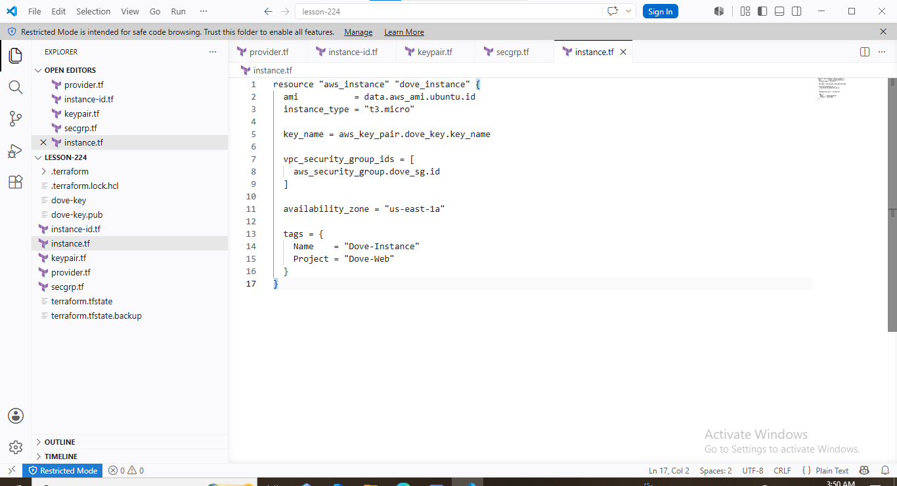

*Terraform project structure and configuration files.*

#### Terraform Initialization

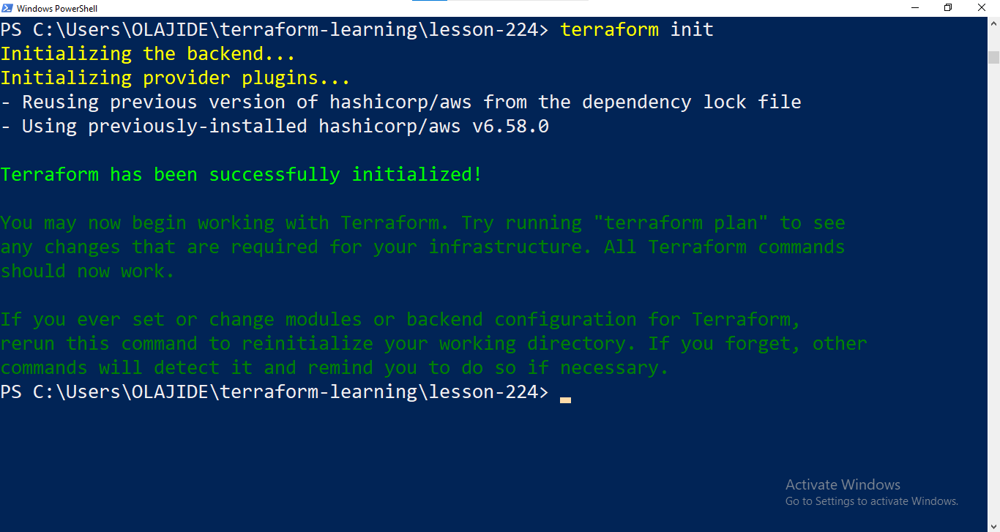

*Successful Terraform provider initialization.*

#### Terraform Validation

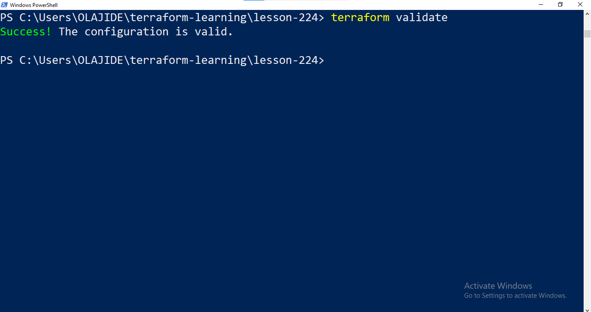

*Successful Terraform configuration validation.*

#### Terraform Plan

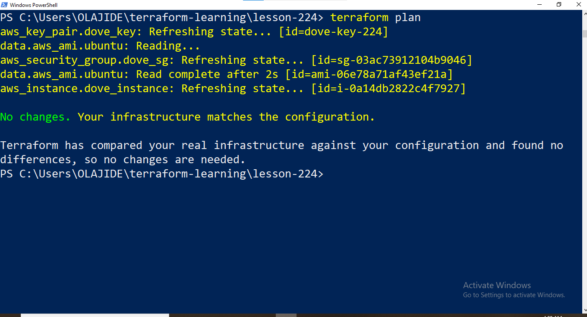

*Terraform plan confirming that no infrastructure changes were required.*

#### Terraform State

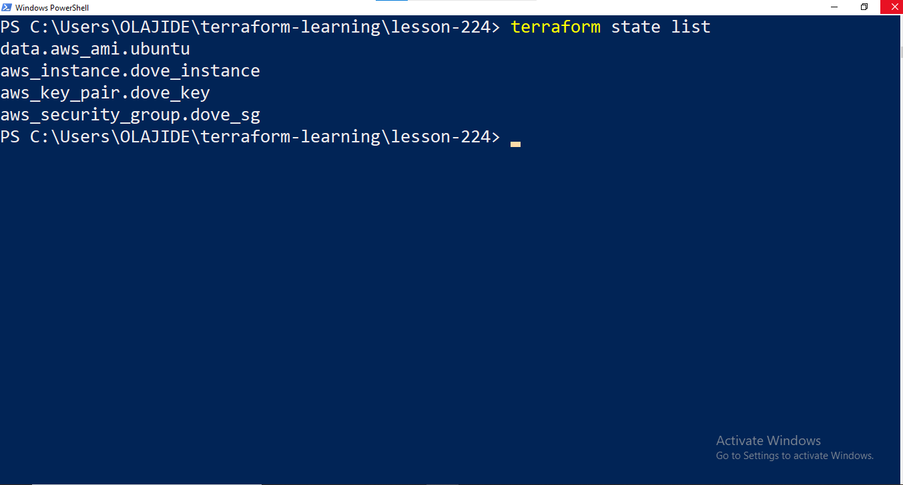

*Terraform state showing managed infrastructure resources.*

#### Security Group Configuration

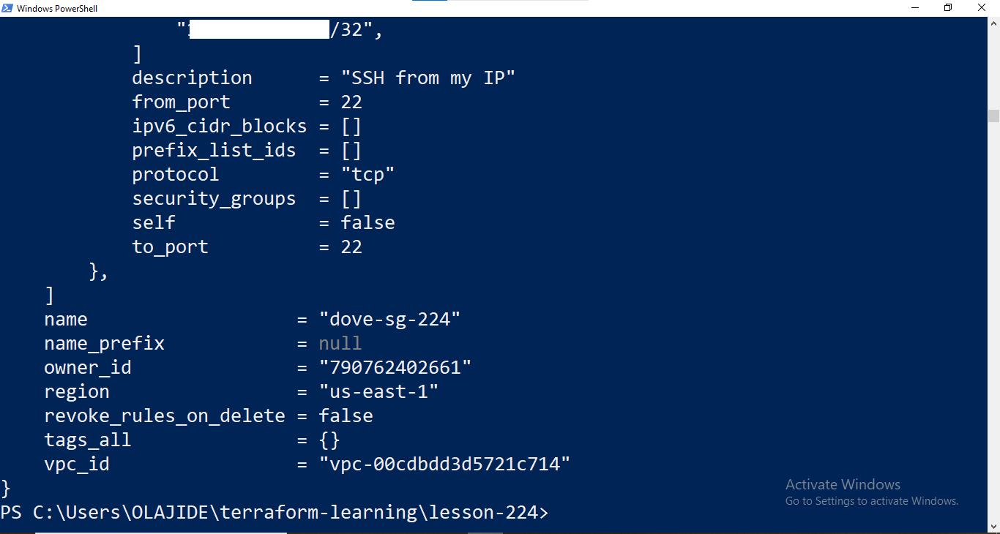

*Terraform security group configuration and network access rules.*

#### EC2 Resource Configuration

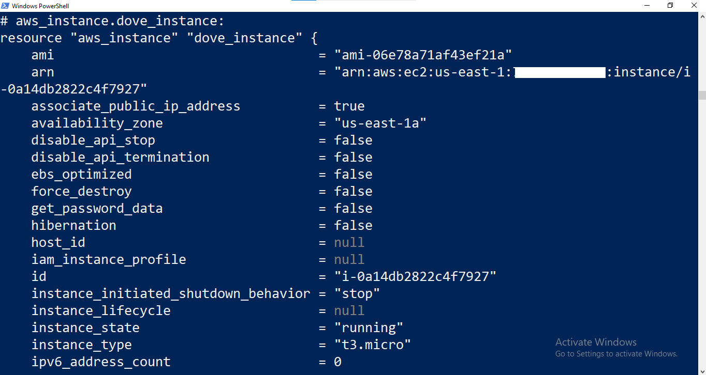

*Terraform configuration for the Amazon EC2 instance.*

#### AWS CLI EC2 Verification

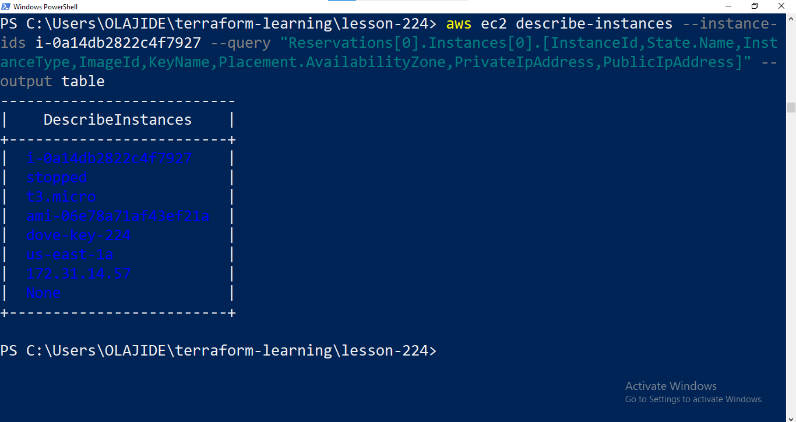

*AWS CLI verification of the provisioned EC2 infrastructure.*

#### AWS Console EC2 Instance

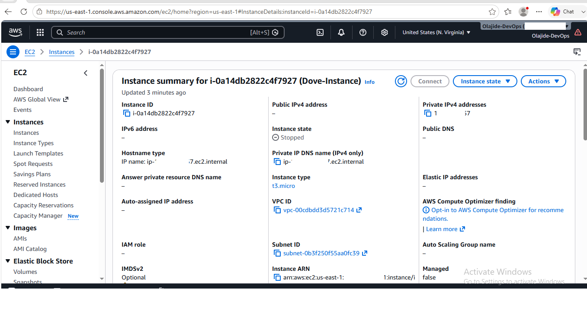

*AWS Management Console verification of the EC2 instance.*

#### AWS Security Group Rules

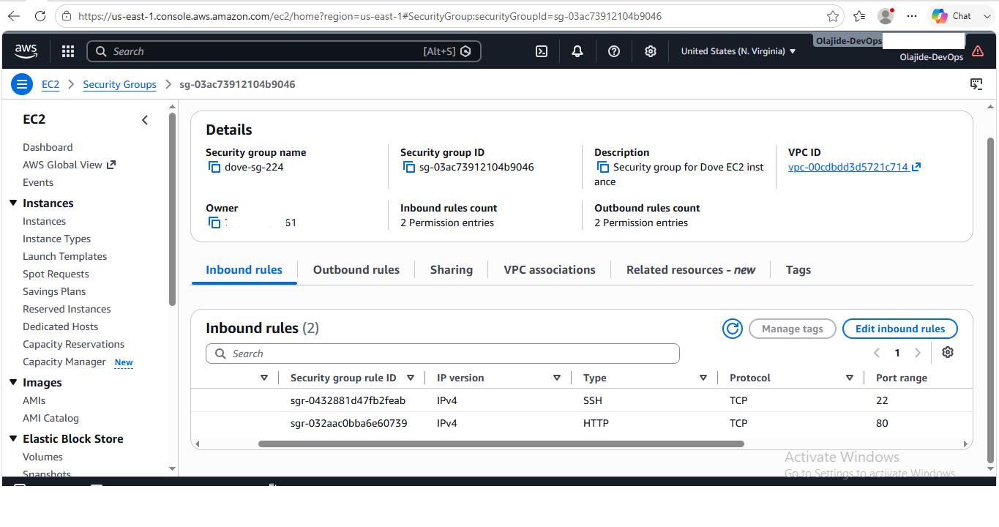

*AWS Management Console verification of the EC2 security group rules.*

---

## 16. Engineering Skills Demonstrated

This project demonstrates practical experience across cloud infrastructure, Infrastructure as Code, Terraform operations, AWS resource management, security configuration, and infrastructure verification.

### Cloud Engineering

- Amazon EC2 provisioning and lifecycle management
- AWS security group configuration
- AWS key-pair management
- Ubuntu AMI selection and management
- AWS CLI-based infrastructure administration
- AWS Management Console verification
- AWS regional infrastructure awareness

### Infrastructure as Code

- Terraform configuration using HCL
- AWS provider configuration
- Terraform resources
- Terraform data sources
- Terraform outputs
- Declarative infrastructure provisioning
- Infrastructure planning and change review
- Terraform state management
- Infrastructure reconciliation

### Terraform Engineering

- `terraform fmt`
- `terraform init`
- `terraform validate`
- `terraform plan`
- `terraform apply`
- Terraform provider dependency management
- AMI discovery through data sources
- Resource lifecycle management
- State-based infrastructure tracking
- No-change plan verification

### DevOps Practices

- Infrastructure automation
- Configuration-driven infrastructure management
- CLI-based cloud operations
- Infrastructure verification
- Configuration validation
- Change detection
- Troubleshooting and diagnostic workflows
- Security-conscious source-code management
- Cloud cost awareness
- Evidence-based infrastructure documentation

### Security and Operational Practices

- Restricted SSH access using a `/32` source address
- Public HTTP access configuration
- AWS credential protection
- SSH private-key protection
- Terraform state protection
- `.gitignore` configuration for sensitive artifacts
- Controlled infrastructure lifecycle management
- AWS resource cost awareness

---

## 17. Key Engineering Lessons

The implementation provided practical experience with designing, provisioning, validating, and reconciling AWS infrastructure through Terraform.

### Declarative Infrastructure

Terraform allows infrastructure to be described declaratively rather than relying on manual, sequential configuration steps. This makes the desired infrastructure state explicit and repeatable.

### Plan Before Apply

`terraform plan` provides an important control point before infrastructure changes are executed.

Reviewing the proposed changes helps reduce unintended modifications and provides visibility into what Terraform intends to create, modify, or remove.

### Terraform State Is Fundamental

Terraform state provides the relationship between the configuration and the infrastructure resources Terraform manages.

Understanding state is therefore essential for reliable infrastructure provisioning, change detection, and reconciliation.

### Data Sources Enable Dynamic Discovery

Terraform data sources can retrieve information about existing AWS resources and services without requiring that information to be manually hard-coded.

The AMI discovery implementation demonstrated how data sources can dynamically identify an appropriate image for EC2 provisioning.

### AMI IDs Are Region-Specific

AMI identifiers are associated with specific AWS regions and image versions.

Infrastructure configurations should therefore account for regional availability when selecting AMIs rather than assuming that a single AMI ID is universally valid across AWS regions.

### Security Must Be Part of Infrastructure Design

Infrastructure configuration should include appropriate access controls from the beginning.

The project demonstrated this through restricted SSH access, protected private-key material, AWS credential handling, and exclusion of sensitive Terraform artifacts from source control.

### Verification Should Be Independent

Terraform output alone should not be the only source of truth when validating cloud infrastructure.

The project used both Terraform and AWS-native tooling, including the AWS CLI and AWS Management Console, to independently verify the resulting infrastructure.

### Cost Awareness Is an Operational Responsibility

Cloud infrastructure should be actively managed throughout its lifecycle.

Stopping the unused EC2 instance after verification reduced unnecessary ongoing compute usage while maintaining awareness that associated resources such as EBS storage may continue to incur charges.

---

## 19. Lessons Learned and Engineering Reflection

### What Worked

The Terraform-based workflow successfully demonstrated the use of Infrastructure as Code to define, provision, verify, and manage AWS infrastructure.

Key successful implementation areas included:

- Terraform-based AWS infrastructure provisioning
- Dynamic AMI discovery
- EC2 instance configuration
- Security group configuration
- EC2 key-pair integration
- Terraform state management
- AWS CLI infrastructure verification
- AWS Management Console verification
- Configuration reconciliation through `terraform plan`

### What Required Troubleshooting

The implementation required iterative validation and verification of the Terraform configuration and AWS infrastructure.

Troubleshooting was approached through Terraform command output, state inspection, AWS CLI verification, and AWS Management Console inspection rather than relying on a single verification source.

This provided multiple points of confirmation throughout the infrastructure lifecycle.

### What Became Clearer Through Hands-On Implementation

The implementation reinforced several practical Terraform concepts:

- Terraform configuration is declarative and describes the desired infrastructure state.
- Terraform resources manage infrastructure, while data sources retrieve information from existing cloud services.
- Terraform state is fundamental to infrastructure tracking and change detection.
- `terraform plan` provides an important control point before infrastructure changes are applied.
- AWS resources must be considered within their regional context.
- Infrastructure verification should be performed independently using cloud-native tools.
- Security and cost considerations should be incorporated into infrastructure lifecycle management.

### Professional Takeaway

The project strengthened practical understanding of Infrastructure as Code by moving beyond Terraform syntax into the operational aspects of cloud infrastructure management.

The implementation demonstrated how Terraform can be used to establish a repeatable workflow for defining infrastructure, reviewing changes, provisioning resources, maintaining state, verifying deployed infrastructure, and managing the resource lifecycle.

The experience also reinforced the importance of combining automation with security, verification, maintainability, and cloud cost awareness when managing AWS infrastructure.

---

## 20. Future Improvements

The current implementation demonstrates a functional Terraform workflow for AWS infrastructure provisioning and management. The following improvements were identified as potential next steps but were **not implemented as part of this project**.

### Remote Terraform State

Move Terraform state from local storage to a secured remote backend, such as Amazon S3, to support centralized state management and collaboration.

### State Locking

Implement state locking to prevent concurrent Terraform operations from modifying shared infrastructure state simultaneously.

### Least-Privilege IAM

Refine AWS IAM permissions to follow the principle of least privilege, granting Terraform only the permissions required for the specific infrastructure operations.

### Terraform Variables

Replace configuration values that are currently defined directly in Terraform files with input variables where appropriate.

This would improve reusability and make environment-specific configuration easier to manage.

### Reusable Terraform Modules

Refactor repeated or related infrastructure configurations into reusable Terraform modules to improve maintainability and support consistent infrastructure patterns.

### Environment Separation

Introduce separate configurations or workspaces for environments such as development, staging, and production.

### CI/CD Integration

Integrate Terraform into a CI/CD pipeline with automated formatting, validation, planning, approval controls, and controlled deployment.

### Security and Policy Scanning

Introduce automated Terraform security and policy scanning to identify configuration risks before infrastructure changes are applied.

Potential tools could include Terraform-native validation and specialized IaC security scanning solutions.

### Infrastructure Testing

Introduce automated infrastructure testing to validate Terraform configurations and deployed resources beyond basic syntax and plan validation.

### Monitoring and Observability

Add monitoring, logging, alerting, and operational visibility for the deployed AWS infrastructure.

### Cost Governance

Introduce AWS Budgets, cost alerts, resource tagging, and automated lifecycle controls to provide stronger ongoing cloud cost governance.

### Production Readiness

These improvements represent potential steps toward a more collaborative, scalable, secure, and production-oriented Terraform implementation.

They are intentionally documented as **future improvements rather than completed capabilities**.

---

## 21. Quality and Documentation Checks

Before publication, the project documentation and repository were reviewed against the following quality and engineering standards.

### Technical Accuracy

- [x] Terraform configuration was tested during implementation.
- [x] Documented Terraform commands reflect the actual workflow.
- [x] AWS region and infrastructure details were verified.
- [x] Resource identifiers documented in the README were verified.
- [x] Terraform terminology is used consistently.
- [x] Completed implementation is distinguished from future improvements.

### Security Review

- [x] No AWS access keys are included in the repository.
- [x] No AWS secret keys are included in the repository.
- [x] Private SSH key material is excluded from version control.
- [x] Terraform state files are excluded from the public repository.
- [x] Local Terraform working directories are excluded from version control.
- [x] Screenshots were reviewed for sensitive credentials and authentication information.
- [x] AWS authentication details are documented without exposing credentials.

### Repository Review

- [x] Repository structure matches the documented project structure.
- [x] Terraform configuration files are organized by responsibility.
- [x] `.gitignore` protects sensitive local artifacts.
- [x] Terraform provider dependency information is committed through `.terraform.lock.hcl`.
- [x] Screenshot filenames correspond to the evidence documented in the README.
- [x] Screenshot images render correctly within GitHub.
- [x] README Markdown renders correctly on GitHub.
- [x] Code blocks use appropriate syntax highlighting.
- [x] Tables render correctly.
- [x] Internal repository links and relative image paths were verified.

### Documentation Standards

- [x] Documentation focuses on engineering implementation rather than course lessons.
- [x] No fabricated implementation results are included.
- [x] Verified implementation evidence is distinguished from future improvements.
- [x] Technical explanations are written for both technical and non-technical stakeholders.
- [x] The README uses relevant Terraform, AWS, Infrastructure as Code, DevOps, and cloud infrastructure terminology.
- [x] The documentation maintains consistency with the repository implementation and captured evidence.

---
