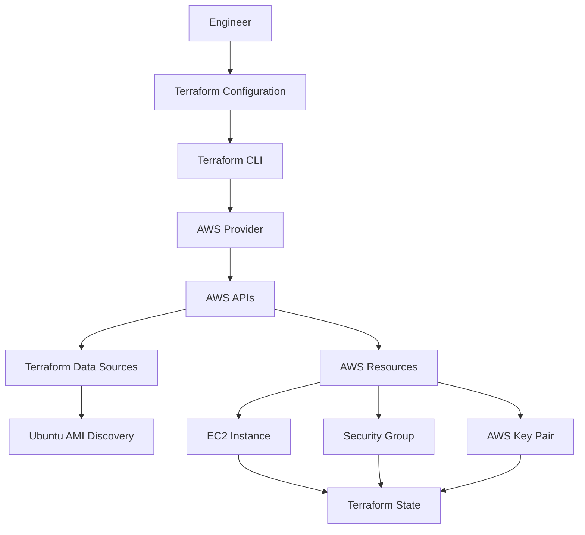

# Terraform Infrastructure Automation — AWS

---
[](https://developer.hashicorp.com/terraform)
[](https://aws.amazon.com/)
[](https://github.com/olajide-adedayo/terraform-infrastructure-automation-aws)

---

## Infrastructure as Code implementation for provisioning and managing AWS compute infrastructure with Terraform.

This project demonstrates a production-oriented Terraform workflow for defining, provisioning, validating, and managing AWS infrastructure through declarative configuration. The implementation includes Amazon EC2 provisioning, dynamic AMI discovery, SSH security-group configuration, Terraform state management, infrastructure planning, deployment, lifecycle operations, and post-deployment verification.

Core Technologies: Terraform · AWS · Amazon EC2 · AWS CLI · Infrastructure as Code»

---

## 1. Project Overview

### Purpose

This project implements an Infrastructure as Code (IaC) workflow for provisioning and managing AWS compute infrastructure using Terraform. The objective is to replace manual infrastructure configuration with a repeatable, declarative, and version-controlled approach to AWS resource management.

### Project Summary

The implementation provisions an Amazon EC2 instance using Terraform and integrates supporting AWS infrastructure components required for secure and controlled access.

The Terraform configuration defines the infrastructure, dynamically discovers a suitable Ubuntu AMI, creates an EC2 key pair, configures a security group, provisions the compute instance, and manages the resulting infrastructure through Terraform state.

The deployed infrastructure was validated through Terraform commands, AWS CLI queries, and the AWS Management Console to confirm that the declared configuration corresponded with the actual AWS environment.

### Engineering Scope

The project covers:

- Terraform-based Infrastructure as Code
- AWS provider configuration
- Amazon EC2 provisioning
- Dynamic Ubuntu AMI discovery using a Terraform data source
- EC2 key-pair management
- Security-group configuration
- Restricted SSH access using a specific IPv4 source
- HTTP access configuration
- Terraform state management
- Infrastructure validation and execution planning
- Infrastructure deployment and lifecycle operations
- AWS CLI-based infrastructure verification
- AWS Management Console verification
- Cost-conscious EC2 lifecycle management
- Secure handling of private keys and Terraform state files

### Implementation Outcome

The completed implementation successfully provisioned and managed the defined AWS infrastructure through Terraform, with the resulting resources verified against Terraform state and the AWS environment.

The EC2 instance was subsequently stopped after verification as part of the project's cost-control and resource-lifecycle management practices.

---

## 2. Engineering Objective

### Problem

Managing cloud infrastructure manually can introduce configuration inconsistencies, reduce repeatability, and make infrastructure changes difficult to track and reproduce. A declarative Infrastructure as Code approach provides a controlled way to define infrastructure requirements, review proposed changes, and maintain alignment between configuration and deployed resources.

### Objective

The objective of this project was to implement a Terraform-driven AWS infrastructure workflow that provides a repeatable and auditable approach to provisioning and managing compute infrastructure.

The implementation was designed to demonstrate practical engineering capabilities across:

- Declarative infrastructure definition
- AWS resource provisioning through Terraform
- Dynamic AMI discovery
- Secure network-access configuration
- Terraform state management
- Infrastructure validation and change planning
- Controlled infrastructure deployment
- Post-deployment verification
- EC2 lifecycle and cost management

### Expected Outcome

The expected outcome was a functioning AWS infrastructure environment provisioned from Terraform configuration and verifiable through both Terraform and AWS tooling.

The implementation achieved this outcome by provisioning the defined EC2 infrastructure, maintaining its state through Terraform, validating the resulting AWS resources, and performing lifecycle operations after successful verification.

---

## 3. Solution Architecture

The solution uses Terraform as the Infrastructure as Code control layer between the local engineering environment and AWS. Terraform evaluates the declared configuration, retrieves required information through AWS data sources, provisions the defined resources through the AWS provider, and records the resulting infrastructure in Terraform state.

### Architecture Workflow


### Architecture Components

Component| Role
Terraform| Declaratively defines and manages the AWS infrastructure
Terraform AWS Provider| Enables Terraform to communicate with AWS APIs
AWS EC2| Provides the compute infrastructure provisioned by Terraform
Terraform Data Source| Dynamically retrieves the appropriate Ubuntu AMI information
AWS Security Group| Controls inbound network access to the EC2 instance
AWS Key Pair| Provides SSH authentication capability for the EC2 instance
Terraform State| Records the relationship between Terraform configuration and managed AWS resources
AWS CLI| Provides command-line verification of deployed AWS infrastructure

### Infrastructure Flow

The implementation follows a declarative workflow:

Terraform Configuration
        |
        v
terraform init
        |
        v
terraform validate
        |
        v
terraform plan
        |
        v
terraform apply
        |
        v
AWS Infrastructure
        |
        v
Terraform State
        |
        v
AWS CLI / AWS Console Verification

### Design Characteristics

The architecture is intentionally simple and modular at the resource-configuration level, while demonstrating core Terraform engineering practices:

- Declarative infrastructure management
- Dynamic infrastructure information retrieval
- Separation of infrastructure resources and data sources
- Controlled network access
- State-based infrastructure reconciliation
- Plan-before-apply workflow
- Independent verification of deployed resources

---

## 4. Technology Stack

Technology| Role in the Project
Terraform| Infrastructure as Code for defining, provisioning, and managing AWS infrastructure
Amazon Web Services (AWS)| Cloud platform hosting the provisioned infrastructure
Amazon EC2| Compute infrastructure provisioned and managed through Terraform
AWS Security Groups| Network access control for the EC2 instance
AWS Key Pair| SSH authentication mechanism associated with the EC2 instance
Terraform AWS Provider| Integration layer between Terraform and AWS APIs
Terraform Data Sources| Dynamic discovery of AWS infrastructure information, including the Ubuntu AMI
Terraform State| Tracks managed infrastructure and enables configuration-to-resource reconciliation
AWS CLI| Command-line inspection and verification of AWS resources
PowerShell| Local command-line environment used to execute Terraform and AWS CLI workflows
Visual Studio Code| Development environment used to create and manage Terraform configuration

Infrastructure Technologies

- Cloud Platform: AWS
- Compute: Amazon EC2
- Infrastructure as Code: Terraform
- Operating System Image: Ubuntu Server
- Network Security: AWS Security Groups
- Authentication: AWS Key Pair / SSH
- Infrastructure Verification: Terraform CLI, AWS CLI, AWS Management Console

Terraform Capabilities Demonstrated

- Provider configuration
- Resource definitions
- Data sources
- Resource attributes and dependencies
- Outputs
- Terraform state management
- Configuration validation
- Execution planning
- Infrastructure provisioning
- Infrastructure reconciliation
- Resource lifecycle management

---

## 5. Repository Structure

The repository uses a modular Terraform configuration structure in which infrastructure components are separated into focused Terraform files. This improves readability, maintainability, and clarity when managing individual infrastructure components.

```text
terraform-infrastructure-automation-aws/
│
├── screenshots/
│   ├── 01-terraform-project-structure.png
│   ├── 02-terraform-init-success.png
│   ├── 03-terraform-validate-success.png
│   ├── 04-terraform-plan-no-changes.png
│   ├── 05-terraform-state-resources.png
│   ├── 06-terraform-security-group-configuration.png
│   ├── 07-terraform-ec2-resource.png
│   ├── 08-aws-ec2-verification.png
│   ├── 09-aws-console-ec2-instance.png
│   └── 10-aws-security-group-rules.png
│
├── .gitignore
├── .terraform.lock.hcl
├── instance-id.tf
├── instance.tf
├── keypair.tf
├── provider.tf
├── secgrp.tf
└── README.md
```

### File Responsibilities

| File / Directory | Responsibility |
|---|---|
| `provider.tf` | Configures the Terraform AWS provider and target AWS region |
| `instance.tf` | Defines the Amazon EC2 instance and its configuration |
| `instance-id.tf` | Defines the Terraform output for the EC2 instance ID |
| `keypair.tf` | Defines the AWS EC2 key-pair configuration |
| `secgrp.tf` | Defines the AWS security group and its network access rules |
| `.terraform.lock.hcl` | Records the selected Terraform provider version and dependency checksums |
| `.gitignore` | Specifies files and directories that should not be tracked by Git |
| `screenshots/` | Contains selected screenshots documenting the implementation and verification evidence |
| `README.md` | Provides the technical documentation for the project |

---

## 6. Terraform Configuration

The infrastructure is defined using Terraform's declarative configuration language (HCL). The configuration is separated into focused Terraform files, with each file responsible for a specific infrastructure or configuration concern.

### Provider Configuration

The AWS provider establishes the connection between Terraform and the AWS environment and specifies the AWS region in which the infrastructure is managed.

The project uses the AWS provider with the deployment region configured as:

```hcl
provider "aws" {
  region = "us-east-1"
}
```

This configuration directs Terraform to manage the project's AWS resources in the **US East (N. Virginia) — `us-east-1`** region.

### Resource Configuration

The project defines AWS infrastructure using Terraform resources.

The primary compute resource is an Amazon EC2 instance. Supporting resources include the EC2 key pair and security group required for instance access and network control.

The main resource configuration is organized as follows:

| Configuration | Purpose |
|---|---|
| `instance.tf` | Defines the Amazon EC2 instance |
| `keypair.tf` | Defines the EC2 key-pair configuration |
| `secgrp.tf` | Defines the security group and network access rules |

Terraform evaluates these resource definitions and determines the required actions during `terraform plan` before changes are applied to AWS.

### Data Sources

The project uses a Terraform data source to dynamically discover an appropriate Ubuntu AMI rather than hard-coding an AMI ID without verification.

The AMI lookup uses defined selection criteria, including the AMI owner and image characteristics, allowing Terraform to retrieve a suitable image available in the configured AWS region.

This approach is useful because **AMI IDs are region-specific** and can change as new image versions are published.

### Outputs

The project exposes the EC2 instance ID through a Terraform output.

The output is defined in:

```text
instance-id.tf
```

The output provides a convenient way to retrieve the identifier of the Terraform-managed EC2 instance after deployment.

### Configuration Organization

The Terraform configuration follows a simple separation of concerns:

```text
provider.tf
    │
    ├── AWS Provider
    │
    ├── instance.tf
    │      └── EC2 Instance
    │
    ├── keypair.tf
    │      └── EC2 Key Pair
    │
    ├── secgrp.tf
    │      └── Security Group
    │
    └── instance-id.tf
           └── EC2 Instance ID Output
```

This structure keeps the configuration readable while allowing Terraform to treat the `.tf` files in the working directory as a single configuration.

---

## 7. AMI Discovery and Selection

Amazon Machine Images (AMIs) provide the operating system and software baseline used when launching EC2 instances. Because AMI identifiers are specific to AWS regions and image versions, selecting an appropriate AMI is an important part of reliable EC2 provisioning.

### Why AMI Discovery Matters

Hard-coding an AMI ID without understanding its region, publisher, architecture, or image version can make infrastructure configurations less portable and more difficult to maintain.

Terraform data sources provide a way to query existing AWS information and use the resulting data within infrastructure configuration.

In this project, Terraform was used to discover an appropriate Ubuntu AMI for the EC2 instance rather than relying solely on an unexplained hard-coded image identifier.

### AMI Selection Criteria

The AMI discovery configuration used criteria based on the required Ubuntu image characteristics, including:

- Ubuntu operating system
- AWS region
- AMI owner
- Image naming pattern
- Compatible virtualization characteristics
- Most recent matching image

The AMI owner value used for the Ubuntu image lookup was:

```text
099720109477
```

This identifies the Ubuntu publisher used by the AMI discovery configuration.

### Discovery Method

The AMI was discovered through a Terraform AWS data source. Terraform queried AWS for images matching the configured criteria and selected the most recent matching image.

The resulting AMI information was then used by the EC2 resource configuration.

This approach separates **AMI discovery** from **EC2 resource provisioning**, allowing the infrastructure configuration to obtain the required image information dynamically.

### AMI Verification

The deployed EC2 instance was verified through AWS tooling, confirming the AMI used by the running infrastructure.

Verified instance information included:

| Attribute | Verified Value |
|---|---|
| Instance ID | `i-0a14db2822c4f7927` |
| AMI ID | `ami-06e78a71af43ef21a` |
| AMI Platform | Linux/UNIX |
| AMI Operating System | Ubuntu Server 22.04 LTS |
| AWS Region | `us-east-1` |
| Availability Zone | `us-east-1a` |

The AWS Console identified the image as:

```text
ubuntu/images/hvm-ssd/ubuntu-jammy-22.04-amd64-server-20260731
```

### Engineering Consideration

Using an AMI data source improves the maintainability of the configuration by allowing Terraform to discover an appropriate image based on defined criteria.

However, dynamically selecting the most recent image also means that future executions may resolve to a newer image when the matching criteria change. In production environments, AMI selection should therefore be balanced between **automation, reproducibility, security updates, and controlled image versioning**.

---


